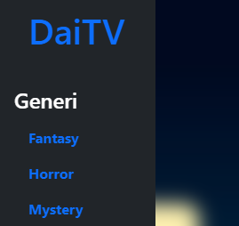
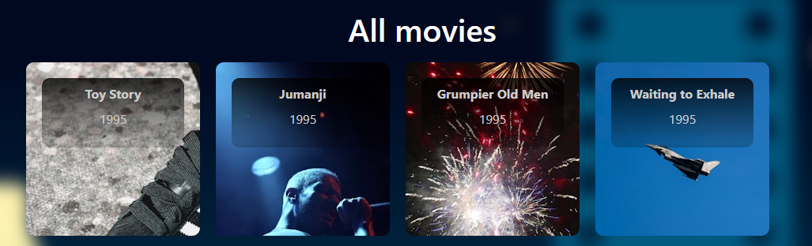
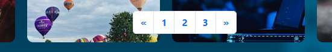
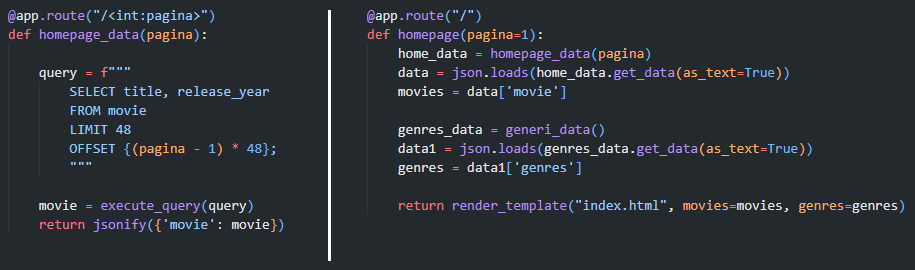

# DaiTV gruppo 5
## Alessandro, Davide, Marco e Riccardo
### Stato attuale
<details open>
<summary><strong> 🎦 Clicca qui per nascondere la gif </strong></summary>


</details>

### Mission progetto
Creare una web app di streaming video che garantisca facile visone del più ampio numero di titoli del genere preferito.

### Funzionamento

Dopo aver avviato un server MySQL/MariaDB, eseguire il file ```main.py``` per caricare il database.

 
#### > main.py

```python 
try:
    conn.create_db(drop=False)
    queries.create_tables()

    import popolamento_tabelle as pt

    pt.inserimento_film()
    pt.inserimento_utente()
    pt.inserimento_generi()
    pt.inserimento_ratings()
    pt.inserimento_type()
except:
    print("\nOperazioni fermate, è già presente un database! \nPer eliminarlo e caricarlo nuovamente utilizzare il parametro 'drop=True'\n")
```

Come indicato nell'```except``` il parametro ```drop=False``` assicura di non eliminare accidentalmente il database. <br>
Per cancellare e caricare nuovamente il database, impostare il parametro come ```drop=True```

#### > connessioni.py

Per modificare le credenziali del database è presente la variabile ```db_config``` all'interno del file ```connessioni.py```
```python
db_config = {
    'host': 'localhost',
    'user': 'root',
    'password': '',
    'database': 'daitv'
}
```

#### > app.py

Infine per eseguire la web app avviare il file ```app.py```

### Struttura
### Barra laterale



Lateralmente è presente una navbar che da accesso ai generi. <br>
La barra è sempre presente, sempre accessibile e di dimensione fissa, è il contenuto della pagina ad adattarsi. Al momento risulta responsive fino alla dimensione mobile.

#### TO DO 
* Non sono ancora attivi i link per le pagine dei generi
    1) Creare la struttura per il caricamento automatico delle pagine collegate
    1) Definire le queries per i filtri
    1) Implementare la generazione automatica dei link per ciascun genere

* Sui dispositivi mobile, la visione della barra non avviene correttamente e la visione del contenuto della pagina è limitata.
    1) Implementare una barra laterale a scomparsa per i dispositivi mobile

### Cards



La struttura centrale presenta cards quadrate che mostrano le informazioni principali di ogni film.
Le cards sono mostrate in pagine da 48 elementi.

#### TO DO
* Le cards sono mostrate in ordine di inserimento nel database
    1) Definire le queries per ordinare gli show
    1) Aggiungere alla pagina dei filtri di ordinamento
    1) Valutare l'ordinamento iniziale con cui si presenta la pagina. Es. rating maggiore

* Non è stato implementato un sistema di analisi delle valutazioni dei film, presenti nel database
    1) Definire le queries per ottenere la valutazione media per show
    1) Implementare il collegamento di ogni card al proprio rating medio
    1) Valutare la rappresentazione del rating su ogni card

* Non tutti i titoli sono visualizzati correttamente
    1) Terminare una pulizia avanzata dei dati

* Manca sistema CRUD
    1) Valutare modifiche al layout per l'aggiunta delle diverse opzioni
    1) Definire queries
    1) Aggiungere collegamenti con interfaccia

* La visione delle cards è limitata sui dispositivi mobile
    1) Implementare una rappresentazione ridotta per i dispositi mobile

### Barra di navigazione delle pagine



In posizione fissa in basso alla finestra si trova la barra di navigazione delle pagine

### TO DO
* Non sono ancora attivi i collegamenti per le pagine
    1) Implementare il passaggio a pagine successive

    

    2) Implementare un sistema di modifica della struttura della barra di navigazione in base al numero di pagine presenti
    1) Collegare links alle queries già definite

### Varie ed eventuali
* Aggiungere sistema di gestione dei dati tramite MongoDB
* Aggiungere la visualizzazione di grafici -che è in corso di sviluppo- come funzionalità aggiuntiva del sito

    


